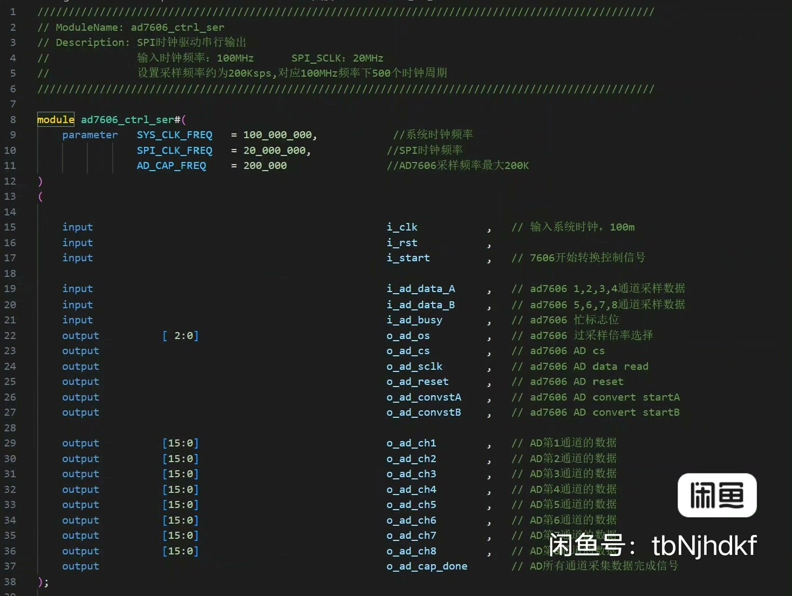
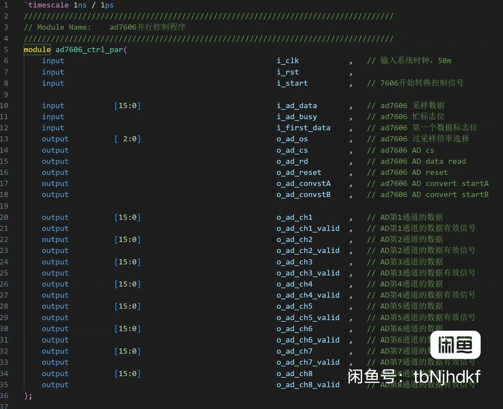
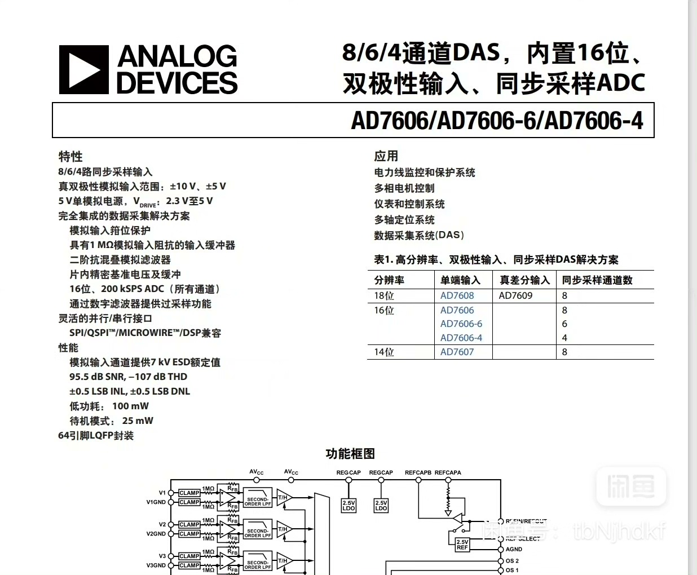
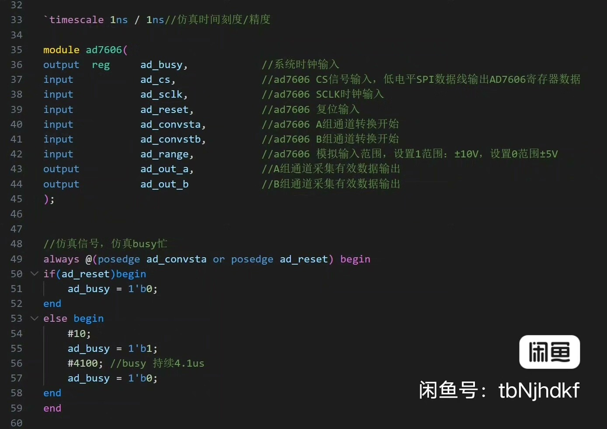
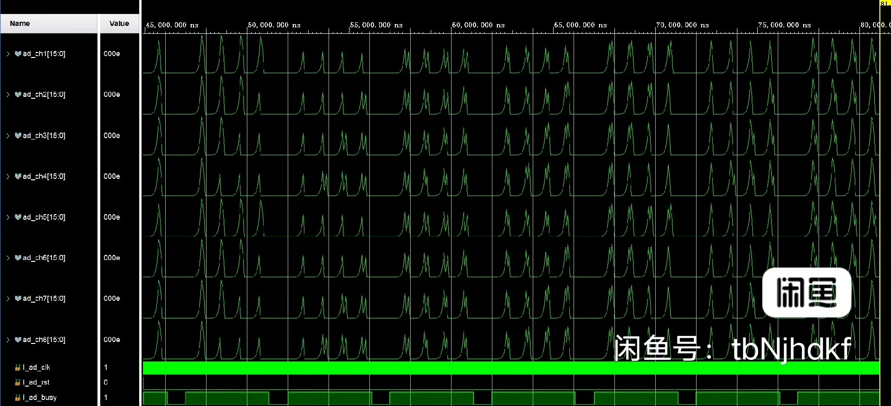

# module AD7606_SPI (

## Body

module AD7606_SPI (
    input wire clk,
    input wire reset,
    input wire [3:0] spi_clk,
    input wire [3:0] spi_data,
    output wire [3:0] spi_cs,
    output wire [3:0] spi_sck,
    output wire [3:0] spi_mosi,
    output wire [3:0] spi_miso,
    output wire [3:0] spi_ss,
    output wire [3:0] spi_ssd,
    output wire [3:0] spi_ssdq,
    output wire [3:0] spi_ssdqp,
    output wire [3:0] spi_ssdqpn,
    output wire [3:0] spi_ssdqpn2,
    output wire [3:0] spi_ssdqpn3,
    output wire [3:0] spi_ssdqpn4,
    output wire [3:0] spi_ssdqpn5,
    output wire [3:0] spi_ssdqpn6,
    output wire [3:0] spi_ssdqpn7,
    output wire [3:0] spi_ssdqpn8,
    output wire [3:0] spi_ssdqpn9,
    output wire [3:0] spi_ssdqpn10,
    output wire [3:0] spi_ssdqpn11,
    output wire [3:0] spi_ssdqpn12,
    output wire [3:0] spi_ssdqpn13,
    output wire [3:0] spi_ssdqpn14,
    output wire [3:0] spi_ssdqpn15,
    output wire [3:0] spi_ssdqpn16,
    output wire [3:0] spi_ssdqpn17,
    output wire [3:0] spi_ssdqpn18,
    output wire [3:0] spi_ssdqpn19,
    output wire [3:0] spi_ssdqpn20,
    output wire [3:0] spi_ssdqpn21,
    output wire [3:0] spi_ssdqpn22,
    output wire [3:0] spi_ssdqpn23,
    output wire [3:0] spi_ssdqpn24,
    output wire [3:0] spi_ssdqpn25,
    output wire [3:0] spi_ssdqpn26,
    output wire [3:0] spi_ssdqpn27,
    output wire [3:0] spi_ssdqpn28,
    output wire [3:0] spi_ssdqpn29,
    output wire [3:0] spi_ssdqpn30,
    output wire [3:0] spi_ssdqpn31,
    output wire [3:0] spi_ssdqpn32,
    output wire [3:0] spi_ssdqpn33,
    output wire [3:0] spi_ssdqpn34,
    output wire [3:0] spi_ssdqpn35,
    output wire [3:0] spi_ssdqpn36,
    output wire [3:0] spi_ssdqpn37,
    output wire [3:0] spi_ssdqpn38,
    output wire [3:0] spi_ssdqpn39,
    output wire [3:0] spi_ssdqpn40,
    output wire [3:0] spi_ssdqpn41,
    output wire [3:0] spi_ssdqpn42,
    output wire [3:0] spi_ssdqpn43,
    output wire [3:0] spi_ssdqpn44,
    output wire [3:0] spi_ssdqpn45,
    output wire [3:0] spi_ssdqpn46,
    output wire [3:0] spi_ssdqpn47,
    output wire [3:0] spi_ssdqpn48,
    output wire [3:0] spi_ssdqpn49,
    output wire [3:0] spi_ssdqpn50,
    output wire [3:0] spi_ssdqpn51,
    output wire [3:0] spi_ssdqpn52,
    output wire [3:0] spi_ssdqpn53,
    output wire [3:0] spi_ssdqpn54,
    output wire [3:0] spi_ssdqpn55,
    output wire [3:0] spi_ssdqpn56,
    output wire [3:0] spi_ssdqpn57,
    output wire [3:0] spi_ssdqpn58,
    output wire [3:0] spi_ssdqpn59,
    output wire [3:0] spi_ssdqpn60,
    output wire [3:0] spi_ssdqpn61,
    output wire [3:0] spi_ssdqpn62,
    output wire [3:0] spi_ssdqpn63,
    output wire [3:0] spi_ssdqpn64,
    output wire [3:0] spi_ssdqpn65,
    output wire [3:0] spi_ssdqpn66,
    output wire [3:0] spi_ssdqpn67,
    output wire [3:0] spi_ssdqpn68,
    output wire [3:0] spi_ssdqpn69,
    output wire [3:0] spi_ssdqpn70,
    output wire [3:0] spi_ssdqpn71,
    output wire [3:0] spi_ssdqpn72,
    output wire [3:0] spi_ssdqpn73,
    output wire [3:0] spi_ssdqpn74,
    output wire [3:0] spi_ssdqpn75,
    output wire [3:0] spi_ssdqpn76,
    output wire [3:0] spi_ssdqpn77,
    output wire [3:0] spi_ssdqpn78,
    output wire [3:0] spi_ssdqpn79,
    output wire [3:0] spi_ssdqpn80,
    output wire [3:0] spi_ssdqpn81,
    output wire [3:0] spi_ssdqpn82,
    output wire [3:0] spi_ssdqpn83,
    output wire [3:0] spi_ssdqpn84,
    output wire [3:0] spi_ssdqpn85,
    output wire [3:0] spi_ssdqpn86,
    output wire [3:0] spi_ssdqpn87,
    output wire [3:0] spi_ssdqpn88,
    output wire [3:0] spi_ssdqpn89,
    output wire [3:

(Full product description was not available from the source page.)

## Images

## Payment

Here is a pay link on Stripe ( https://buy.stripe.com/3cs8yP7sY87d0vu9AB ). Please contact me lonlonago@foxmail.com after funding $89, and I will send you a complete data files , thank you!

